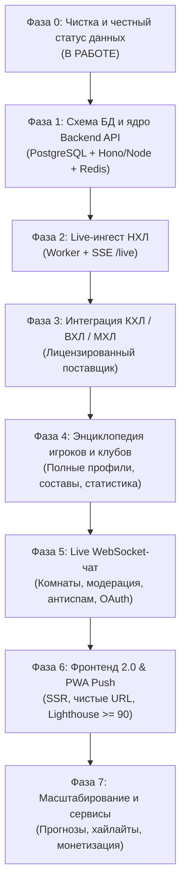

# Hockey365 — Генеральный план трансформации в Live-портал

> **Статус документа:** Активный план архитектурной трансформации  
> **Дата старта:** 4 октября 2026  
> **Цель:** Превращение Hockey365 из статического каталога со снимком данных в полноценный высоконагруженный live-портал хоккея (НХЛ, КХЛ, ВХЛ, МХЛ) с реальным счётом, WebSocket-чатом, базой игроков и команд, SSR и PWA.

---

## 1. Архитектурный разрыв и целевое состояние

| Направление | Текущее состояние (Legacy Static) | Целевое состояние (Live Portal 2.0) |
|---|---|---|
| **Live-матчи** | GitHub Actions cron раз в 5–15 мин, коммиты в git, polling клиентом устаревшего JSON | Ingestion worker (опрос 3–10с в матче) → Redis Pub/Sub + SSE (`/api/live`) с задержкой < 10с |
| **База данных** | 60+ статических JSON файлов в git-репозитории | PostgreSQL (Supabase / Neon) со схемами: `leagues`, `seasons`, `teams`, `players`, `games`, `events` |
| **КХЛ данные** | Непроверенные данные исключены, статус `unverifiedCompetitions` | Лицензированный провайдер (API-Sports / Sportradar / официальный контракт) со сверкой с khl.ru |
| **База игроков** | 13 файлов игроков с ручным заполнением | Автоматический ингест составов, статистики по сезонам, истории переходов и карточек травм |
| **Общение** | Чат отсутствует | WebSocket-чат комнат матчей, лиг и клубов с OAuth-авторизацией, rate-limit и AI-модерацией |
| **Фронтенд** | Чистый vanilla JS на GitHub Pages | Next.js / Astro SSR с чистыми URL (`/team/ska`, `/match/...`), SEO-оптимизацией и Push API |

---

## 2. Дорожная карта и статусы фаз

### Детализация фаз

| Фаза | Название | Статус | Критерий готовности (Definition of Done) |
|---|---|:---:|---|
| **Фаза 0** | **Чистка и честный статус данных** | 🔄 **В работе** | Удалены все демо-матчи КХЛ из `data/`; убран хардкод из HTML; честный баннер о статусе КХЛ; все 24 теста зеленые. |
| **Фаза 1** | **Бэкенд и база данных (Postgres + Redis + API)** | ⏳ Ожидание | Схема Postgres развёрнута; миграции версионированы; API `/api/matches?date=` отвечает < 200 мс; Swagger/OpenAPI спецификация. |
| **Фаза 2** | **Ингест НХЛ и Realtime SSE** | ⏳ Ожидание | Фоновый воркер опрашивает NHL API; события и голы публикуются в Redis; SSE endpoint `/api/live`; задержка гола ≤ 15с. |
| **Фаза 3** | **КХЛ / ВХЛ / МХЛ через лицензированный API** | ⏳ Ожидание | Подключен подтверждённый провайдер; 100% матчей тура совпадают с официальным протоколом; сверка расхождений 0. |
| **Фаза 4** | **Энциклопедия игроков и команд** | ⏳ Ожидание | ≥ 95% игроков активных составов в базе; полная статистика по сезонам; история переходов; H2H клубов. |
| **Фаза 5** | **Живой чат матчей с модерацией** | ⏳ Ожидание | WebSocket-комнаты на матч/лигу; OAuth-вход (Telegram/Google); rate-limit 1 сообщ/5с; фильтр токсичности и спама. |
| **Фаза 6** | **Фронтенд 2.0 (SSR + PWA Push)** | ⏳ Ожидание | Чистые URL без query-параметров; Web Push о голах любимой команды; Lighthouse ≥ 90 (Perf, A11y, SEO, Best Practices). |
| **Фаза 7** | **Рост и монетизация** | ⏳ Ожидание | Прогнозы болельщиков; интеграция легальных хайлайтов; мультиязычность (RU/EN); соответствие 152-ФЗ / GDPR. |

---

## 3. Матрица саб-агентов и зон ответственности

| Саб-агент | Роль | Зона ответственности | Вход → Выход |
|---|---|---|---|
| **Data Source Researcher** | Исследователь источников | Анализ тарифов, API и задержек Sportradar, API-Sports, SportMonks | ТЗ → Сравнительная матрица и выбор провайдера |
| **Database Architect** | Архитектор данных | Моделирование PostgreSQL, миграции, индексы матчей/событий | Требования → SQL DDL, Prisma/Drizzle схемы |
| **Data Ingestion Engineer** | Инженер ингеста | Воркеры синхронизации, адаптеры API, нормализация, ретраи | API провайдера → БД + Redis стрим |
| **Backend/API Engineer** | Бэкенд-разработчик | REST API (Hono/Node), SSE `/api/live`, кэширование, rate-limit | Схема БД → Защищенный HTTP/SSE API |
| **Realtime & Chat Engineer**| Разработчик чата | WebSocket сервер, комнаты матчей, presence, хранение сообщений | WebSocket API → Масштабируемый live-чат |
| **Moderation & Trust** | Офицер безопасности | Фильтрация ненормативной лексики, жалобы, теневой бан, антиспам | Поток сообщений → Чистый модерируемый чат |
| **Lead Frontend Engineer** | Ведущий фронтенд | SSR-миграция (Next.js/Astro), чистые URL, адаптивные компоненты | API + дизайн-токены → Быстрый SSR интерфейс |
| **Senior UI/UX Designer** | Дизайнер интерфейсов | Макеты комнат чата, live-табло, профилей команд и игроков | Бриф → Компоненты дизайн-системы |
| **QA / Data Verifier** | Инженер контроля качества| Сверка счетов с официальными протоколами, e2e тесты | Среда → Зелёный отчёт соответствия |
| **Security & Legal Reviewer**| Юрист и ИБ-аудитор | 152-ФЗ, авторские права на логотипы, правила чата, XSS | Код и данные → Юридическая чистота |

---

## 4. Контрольные ворота качества (Quality Gates)

Ни одна фаза не закрывается без выполнения следующих условий:
1. **0 вымышленных фактов**: Любая сущность в системе снабжена полями `source`, `fetchedAt` и `confidence`.
2. **Зелёный отчёт QA**: 100% unit и e2e тестов пройдены без ошибок.
3. **Безопасность**: Отсутствие уязвимостей XSS в чате, безопасное хранение персональных данных (хэширование, RLS).
4. **Регрессионное тестирование**: Сохранение дизайн-токенов тёмной темы Dark Ice Void (`#0B0E14`) и WCAG AAA контраста.
